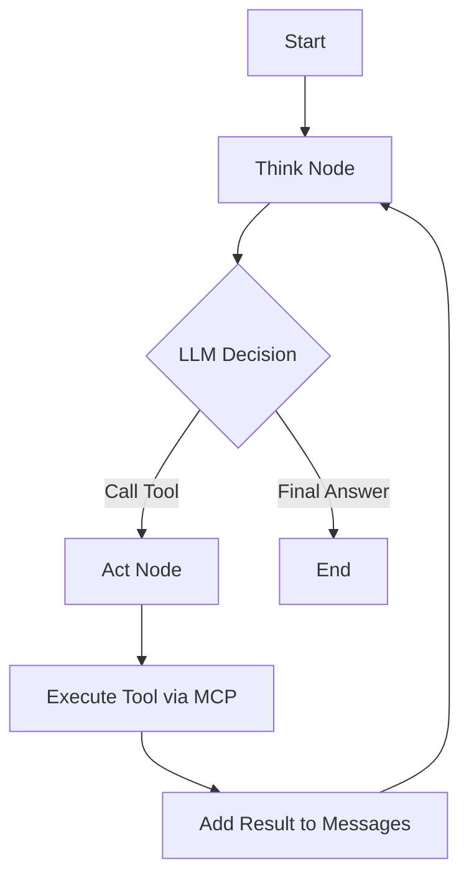

# MCP Weather Agent - Architecture Documentation

## Overview

This project implements a Model Context Protocol (MCP) HTTP server with three integrated tools and a LangGraph-based ReAct agent that consumes these tools to answer questions about the data center's weather.

```
┌──────────────────┐     HTTP      ┌──────────────────┐
│                  │◄─────────────►│                  │
│   ReAct Agent    │               │   MCP Server     │
│   (LangGraph)    │               │   (FastAPI)      │
│                  │               │                  │
└────────┬─────────┘               └────────┬─────────┘
         │                                  │
         │ Gemini API                       │ External APIs
         │                                  │
         ▼                                  ▼
┌──────────────────┐               ┌──────────────────┐
│  Google Gemini   │               │  IPify, IP-API,  │
│  2.0 Flash       │               │  Open-Meteo      │
└──────────────────┘               └──────────────────┘
```

## Components

### 1. MCP HTTP Server (`src/mcp_server/`)

FastAPI-based server exposing three tools via HTTP endpoints.

| File | Purpose |
|------|---------|
| `main.py` | FastAPI app with /tools and /tools/{name}/call endpoints |
| `tools.py` | Tool implementations calling external APIs |
| `models.py` | Pydantic models for input validation |

**Endpoints:**
- `GET /` - Health check
- `GET /tools` - List available tools (MCP discovery)
- `POST /tools/{tool_name}/call` - Execute a tool

**Tools:**
| Tool | API | Purpose |
|------|-----|---------|
| `ipify` | api.ipify.org | Get server's public IP |
| `ip_to_geo` | ip-api.com | Convert IP to lat/lon |
| `weather_forecast` | api.open-meteo.com | Get weather for coordinates |

### 2. MCP Client (`src/mcp_client/`)

Async Python client for the agent to consume the MCP server.

**Key Methods:**
- `list_tools()` - Fetch tool definitions
- `call_tool(name, params)` - Execute tool with validation
- `get_tools_for_llm()` - Format tools for LLM function calling

### 3. LangGraph ReAct Agent (`src/agent/`)

ReAct (Reasoning + Acting) agent implemented using LangGraph.

## LangGraph State

```python
class AgentState(TypedDict):
    messages: list          # Conversation history
    tool_calls: list        # Trace of executed tools
    current_step: str       # think/act/done
    final_answer: str       # Final response
    pending_tool_call: dict # Tool waiting to execute
```

## ReAct Flow



### Think Node
- Invokes Gemini LLM with system prompt and message history
- LLM outputs JSON: either `{"tool": "name", "params": {...}}` or `{"answer": "..."}`
- Sets `current_step` to "act" or "done"

### Act Node
- Reads `pending_tool_call` from state
- Calls MCP client to execute the tool
- Records result in `tool_calls` trace
- Adds result as `ToolMessage` to conversation
- Returns to Think node

### Routing
Conditional edge after Think:
- If `current_step == "done"` → END
- If `current_step == "act"` → Act node

## Tool-Calling Strategy

The agent is instructed via system prompt to call tools in a specific order:

1. **ipify** → Get the data center's public IP address
2. **ip_to_geo** → Convert IP to geographic coordinates  
3. **weather_forecast** → Get weather for those coordinates

Each tool result is passed to the LLM, which uses actual values for subsequent calls.

## Assumptions & Limitations

### Assumptions
- "Data center" = machine running the MCP server
- Public IP accurately reflects geographic location
- User has a Google API key for Gemini
- MCP server runs on localhost:8000

### Limitations
- **IP-API**: Free tier is HTTP-only (no HTTPS), 45 requests/minute limit
- **Geolocation**: IP-based location may be inaccurate (ISP location, VPNs)
- **Single-threaded**: Agent processes one question at a time
- **No persistence**: No conversation history between sessions
- **Error recovery**: Basic - LLM sees error and may retry

### API Dependencies
| API | Rate Limit | Auth Required |
|-----|------------|---------------|
| IPify | Unlimited | No |
| IP-API | 45/min | No |
| Open-Meteo | Generous | No |
| Gemini | 15 RPM (free) | API Key |
